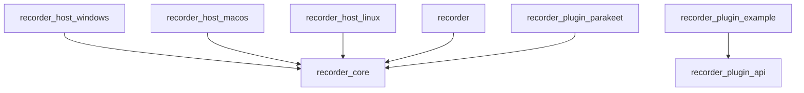
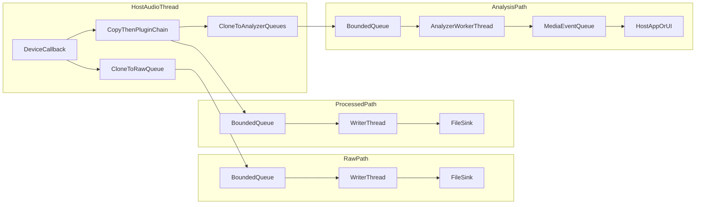
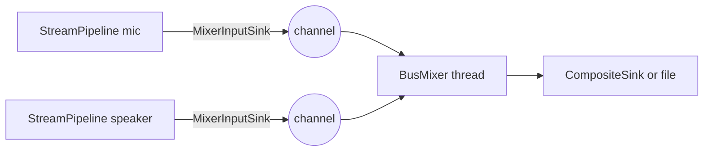

# Recorder workspace architecture

This repository implements the **Rust multi-source audio recorder** design: a portable core, per-OS capture companions, optional C ABI plugins, analyzer/event taps, and file sinks (WAV / FLAC / MP3).

## Crate graph

## Data flow: raw, processed, and analysis

The critical guarantee is **logical isolation of the unprocessed (raw) path** from plugin execution. Analyzer taps receive the processed/enhanced buffer on worker threads so transcription, diarization, and other model work do not block the host audio callback.

- **Raw queue** receives a **clone** of the buffer **before** any `AudioProcessor::process` call.
- **Writer threads** call sinks only; they **never** invoke plugins.
- **Analyzer queues** receive processed/enhanced buffers after the processor chain. Queue overflow drops analyzer input and increments `PipelineMetrics::analyzer_frames_dropped`.
- **Analyzer worker threads** emit typed `MediaEvent`s such as voice activity, speaker segments, transcripts, attributes, and plugin-parameter changes.
- **Plugin budget**: each `process` call is timed; overruns increment `PipelineMetrics::plugin_timeouts` and force **passthrough** on the processed buffer only.
- **Same-process UB** in a native dylib can still crash the host; only WASM/subprocess sandboxes fix that class of failure.

## OS hosts

Each `recorder-host-*` crate implements `AudioHost` for that OS. The current implementation uses **cpal**, which maps to WASAPI (Windows), Core Audio (macOS), and ALSA/Pulse/Jack depending on Linux configuration.

### Capture sources: microphones and speaker loopback

Hosts expose a unified [`CaptureSource`](crates/recorder-core/src/traits.rs) list combining microphone-style **inputs** and speaker-output **loopback** sources via:

- `AudioHost::list_capture_sources()` – every source the host can open.
- `AudioHost::start_capture(source_id, kind, format, on_buffer)` – open either kind.

The legacy `list_input_devices` / `start_input_stream` methods remain (they're delegated to by default impls) so existing callers compile unchanged.

Per-OS loopback support:

| OS | Loopback path | Notes |
|----|---------------|-------|
| Windows | **WASAPI loopback** on each render endpoint | Implemented by calling `cpal::Device::build_input_stream` on an output device (cpal sets `AUDCLNT_STREAMFLAGS_LOOPBACK`). DirectSound, WaveOut, and Dummy backends report `RecordingError::Config("loopback capture is only supported by WASAPI…")`. |
| Linux | **PulseAudio / PipeWire monitor sources** | Devices whose name ends in `.monitor` or contains `Monitor of …` are classified `CaptureSourceKind::Loopback`; capture goes through the standard input-stream path. |
| macOS | **ScreenCaptureKit (macOS 13+)** + virtual loopback drivers | The `screencapturekit` feature on `recorder-host-macos` (default-on) injects a synthetic `scl:system-audio` source. On older macOS or when SCK is unavailable, BlackHole / Loopback / Soundflower / VB-Cable are recognized by name as loopback. |

### Mixed-mode output

Recording two sources at once produces two independent `CaptureStream`s. To combine them into a single file, the optional [`mixer`](crates/recorder-core/src/mixer.rs) module (feature `mixer`, opt-in for `recorder-core`) exposes **`BusMixer`**: an N-input bus worker (the legacy **`StreamMixer`** name remains as a thin two-leg wrapper). Each leg is fed by a [`MixerInputSink`](crates/recorder-core/src/mixer.rs) in the post-processor writer thread:

`BusMixer` runs on its own thread, resamples each leg to the bus sample rate via `rubato::SincFixedIn` when needed, time-aligns legs by `captured_at`, mixes per [`MixMode`](crates/recorder-core/src/mixer.rs) (`SumMono`, `SumStereo`, or two-leg `SplitStereo`), optionally runs a **post-mix** `AudioProcessor` chain (same budget semantics as [`StreamPipeline`](crates/recorder-core/src/pipeline.rs)), then writes to a single [`AudioSink`](crates/recorder-core/src/traits.rs). Use [`CompositeSink`](crates/recorder-core/src/composite.rs) to fan out to several sinks (e.g. WAV + analyzer queue + meter). [`TeeAudioSink`](crates/recorder-core/src/composite.rs) clones buffers to multiple bus queues when one strip feeds more than one bus. [`spawn_single_bus_mixer`](crates/recorder-core/src/graph.rs) and [`MixerGraph::spawn_from_bus_specs`](crates/recorder-core/src/graph.rs) centralize wiring for one or many buses.

`AudioHost` also defines optional **`list_output_devices`** and **`start_output_stream`** (fill callback with interleaved f32) for low-latency monitor output; the default implementation returns an empty device list and `start_output_stream` is unsupported. **Windows** WASAPI and ASIO hosts implement both via cpal.

A soft-knee limiter on sum paths protects against clipping.

### C SDK note

[`recorder-sdk`](crates/recorder-sdk/src/lib.rs) still exposes the original mic ± loopback `RecorderStartConfig`. A future **v2** entry point may accept a serialized mixer graph once the Rust `MixerGraph` API is stable; new fields on the C struct will remain trailing and zero-initialized for compatibility.

## Plugins

1. **In-process Rust processors** (`dyn AudioProcessor`): realtime-ish audio transforms such as gain, denoise, EQ, and VST adapters.
2. **In-process Rust analyzers** (`dyn AudioAnalyzer`): asynchronous observers for voice activity, ASR, diarization, keyword detection, and other metadata.
3. **Controllable plugins** (`dyn ControllablePlugin`): host-mediated parameter surfaces used by UI or automation rules.
4. **C ABI v1** (`recorder-plugin-api`): stable `#[repr(C)]` layout and `recorder_plugin_entry_v1` symbol for audio-in/audio-out processing; see `crates/recorder-plugin-example` for a minimal `cdylib`.

## Local plugin crates

Recorder-native local plugins live under `plugins/` and are linked by Rust host apps that want them.

- `plugins/parakeet-unified` provides `recorder-plugin-parakeet`, an `AudioAnalyzer` that feeds enhanced audio chunks to NVIDIA Parakeet Unified EN 0.6B through a persistent Python/NeMo sidecar and emits transcript `MediaEvent`s.
- Local analyzer plugins are selected in the demo app separately from VST plugins. VSTs remain processor/control plugins; local analyzers are metadata producers.

## Encoders

| Format | Crate / notes |
|--------|----------------|
| WAV | `hound` behind feature `wav` |
| FLAC | `flacenc` (incremental frames) behind feature `flac` |
| MP3 | `mp3lame-encoder` (runtime LAME) behind feature `mp3`; Windows x64 DLL is vendored under `third_party/lame/` (see repo `README.md`) |

## Demo UI

Run the minimal desktop demo (Windows / macOS / Linux):

`cargo run -p recorder-ui`

On **Windows**, pick an **Audio system** (WASAPI, ASIO, DirectSound, WaveOut / waveIn, Dummy), then an **input device** for that stack. Elsewhere, the host is fixed to the OS default. Set a base filename and format (WAV / FLAC / MP3), then **Record** / **Pause** (drops buffers, no disk growth) / **Stop**. **Play last** uses `rodio` + Symphonia for playback.

## CI

GitHub Actions runs `cargo test` on `ubuntu-latest`, `windows-latest`, and `macos-latest` for `recorder-core` without the MP3 feature (CI avoids runtime dependency on LAME); `cargo check --workspace` still type-checks the MP3 code paths.
